# Identity Modernization (Release 3) — Master Architecture & Security Reference

> Reconstructed from 32 screenshots of `estate/review-workspace/explainers/04-identity-r3-architecture-explainer.md`
> (captured 2026-08-22). Original source of that explainer: `R3_Identity_Modernization_Solution_Architecture.pdf`
> (Solution Architecture v1.0, Mar 2026) cross-referenced against the repos:
> `authkit-mfe`, `channels-auth-api`, `credential-auth-service`,
> `sentinel-sdk-core`, `eventbus-adapter`, `customer-info-api`, `atlas-ui`, `sentinel-config`.
>
> This file is the **single source of truth for study**. Everything below is what the system *does*.
> `01-STUDY-PLAN.md` is what you must *master* to own it at architect level.

---

## 0. How to read this document

Every section has three layers, and you should be able to move between them fluently:

| Layer | Question it answers | Why an architect needs it |
|---|---|---|
| **Plain language** | What is happening, in one breath, to a non-security engineer? | You will explain this to product, ops, and auditors far more often than to cryptographers. |
| **Step sequence** | What is the exact ordered call chain? | This is what you review findings against and what you draw on a whiteboard. |
| **Repo evidence / gaps** | Where does the code actually live, and what is *not* proven? | The difference between a senior engineer and an architect is refusing to assert an unproven control. |

The document uses three evidence markers throughout:

- ✅ **implemented & verified in-repo**
- 🟡 **partial** — only one side of the control is present
- ❌ **not in these repos** — backend/gateway config lives elsewhere → treat as **NEEDS-EVIDENCE**, not as a confirmed pass and not as a confirmed failure

---

## 1. The cast of characters (who talks to whom)

| Component | Plain-language role |
|---|---|
| **Atlas UI** | The online/mobile banking web app the customer sees (React/Angular SPA). |
| **AuthKit MFE** (`authkit-mfe`) | A shared micro-frontend, federated into Atlas, that owns the actual "enter password / biometric / OTP" screens and talks to Sentinel. |
| **Sentinel IdP** (`credential-auth-service`, `sentinel-sdk-core`) | The **Identity Provider (IdP)** — Sentinel. Issues tokens, validates passwords/biometrics, enforces DPoP, talks to fraud engines. "The bank vault's front desk." |
| **Atlas BFF** | Backend-for-frontend for Atlas. Holds the customer's **application session** (not the security token) — account summary caching, business rules. |
| **Edge Gateway** | The API gateway in front of business APIs. Validates DPoP proofs, enforces step-up policy for high-risk transactions. |
| **Directory** | LDAP-style credential store — where the actual username/password/aliases live. |
| **GridCache** | In-memory data grid used to speed up login (prefetching account data). |
| **EventBus** | Kafka-like event bus. Every login/logout/step-up/fraud event is published here for downstream consumers. |
| **RiskEngine / risk vendors** | Fraud/risk engines that score a login or transaction as low/medium/high risk. |
| **Warehouse / IdP Datamart / Analytics / Splunk** | Where events end up for reporting, monitoring, and audit. |

### Mental model (memorise this sentence)

> **Atlas UI never talks to the vault directly for security decisions.** Everything security-related — password check, biometric check, token issuance, DPoP validation, fraud scoring — goes through **Sentinel**. Atlas BFF and Gateway only deal with *business* data — **but Gateway does enforce token/DPoP validity on every call.**

### Context diagram

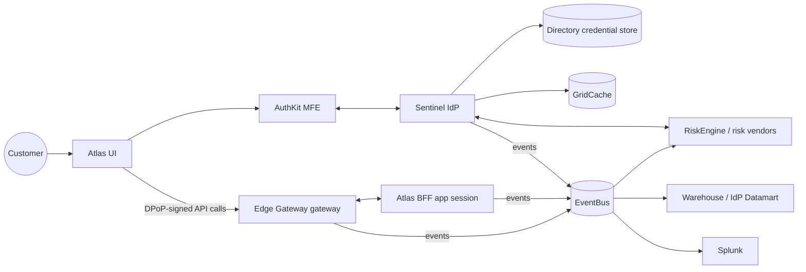

**Architect note — the two-session split.** There are *two* sessions in this system and conflating them is the single most common source of bad findings:
- the **security session**, owned by Sentinel (tokens, grants, token cache), and
- the **application session**, owned by Atlas BFF (`/initAppSession`, account summary, `IDP_Correlation_ID`).

They are tied together only by the `IDP_Correlation_ID` that BFF stores. Logging out of one does not automatically end the other — which is exactly why §6.3 makes Atlas UI call *both* `/logout` (BFF) and `unified_logout` (Sentinel), and clear locally regardless.

---

## 2. Core security concepts, explained simply

### 2.1 OAuth2 Authorization Code Flow (the skeleton every flow rides on)

Think of it like getting a hotel key card:

1. You **prove who you are at the front desk** (Sentinel `/authorize` — enter password/biometric).
2. The front desk doesn't hand you the key card directly. It hands you a **temporary claim ticket** (an *authorization code*).
3. You take that ticket back to the desk's back office (Sentinel `/token` endpoint) and trade it for the actual **key card** (access token) plus a **spare key request slip** (refresh token).
4. The key card gets you into your room (APIs) until it expires; the spare key request slip lets you get a new key card without going through the whole check-in again.

In the doc: Atlas UI calls Sentinel `/authorize`, then `/token`, and stores:

- **Access token** → kept in **application memory only** (not localStorage) — reduces theft via XSS.
- **Refresh token** → kept in **session storage**.
- **DPoP private key** → kept in **IndexedDB** (never leaves the browser). *(See §2.3 — the code is actually stronger than this.)*

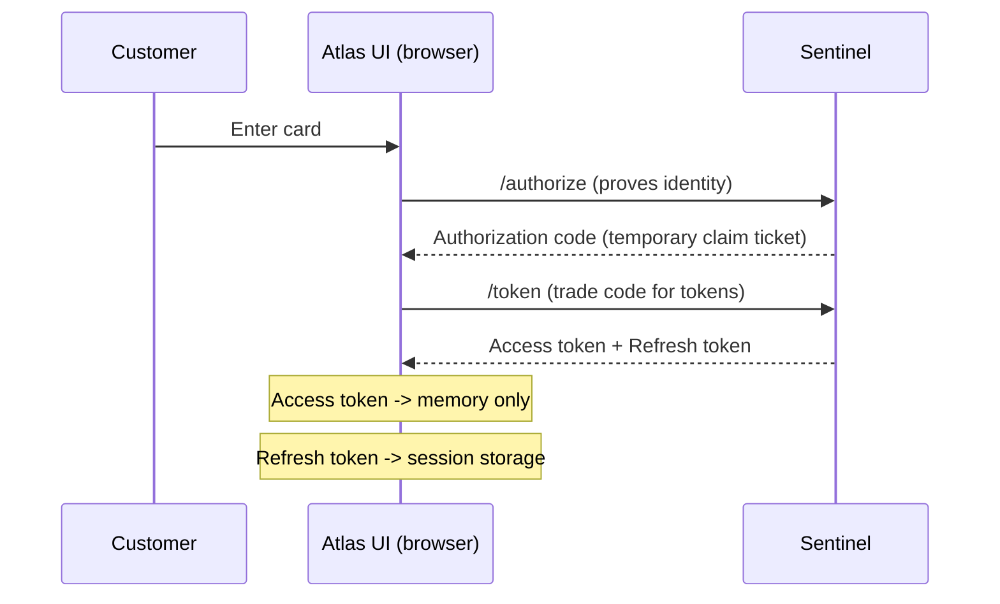

📍 **In our repos (atlas-ui):**
- Token store split is real: access token in memory, everything else in `sessionStorage` — `hybrid-token-storage.service.ts#L13-L58` (`_accessToken` field + `tokens` getter/setter).
- `/token` code-exchange: `auth.service.ts#L280-L285` (`exchangeTokensFromCode`).
- SDK-side `/token` POST attaching the `code_verifier`: `sentinel-sdk-core/src/service/authorization/oauth2.ts#L47`.

⚠️ **Watch:** the ID token returned here is later parsed with `jwt_decode` and **never signature-verified on the client** (`auth.service.ts#L979`, `sso/state/jwt.service.ts#L44-L165`). That is acceptable for a token the client received directly over TLS, **but becomes critical on the server side where `id_token_hint` is decoded without verification** — see Appendix B row 1.

---

### 2.2 Why "code verifier" (PKCE) even though the doc never spells out the acronym

The doc explicitly says Sentinel *"validates code verifier & returns access & refresh tokens"* when the Atlas SPA calls `/authorize`. That is **PKCE (Proof Key for Code Exchange)** — the document just never uses the acronym.

**Plain language:** PKCE exists because a public browser app (no secret it can keep hidden) is requesting an authorization code. Without protection, if an attacker intercepted that authorization code (e.g. via a malicious redirect or an OS-level URL hijack on mobile), they could trade it for tokens themselves.

**The fix:**

1. Before starting login, Atlas UI invents a random secret (`code_verifier`).
2. It hashes that secret (`code_challenge` = SHA-256 of `code_verifier`) and sends **only the hash** to Sentinel `/authorize`.
3. When trading the authorization code for tokens at `/token`, Atlas UI must also send the **original secret** (`code_verifier`).
4. Sentinel re-hashes it and checks it matches the `code_challenge` from step 2. If an attacker stole only the authorization code, they don't have the original secret, so the trade fails.

**Why this matters for findings:** if you ever see a repo generate the authorization code request **without** a `code_challenge`/`code_verifier` pair, or **reuse** the same `code_verifier` across sessions, or **log** the `code_verifier` anywhere (Splunk, EventBus) — flag it. That defeats PKCE's entire purpose.

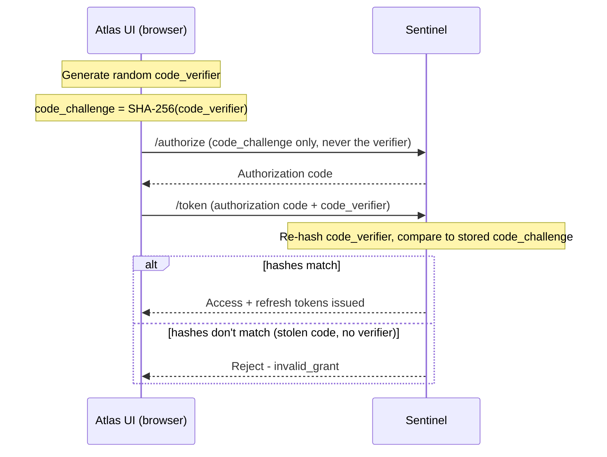

📍 **In our repos (atlas-ui):** PKCE is genuinely implemented — `generateCodeVerifier()` (96-char base64url) and `generateCodeChallenge()` (SHA-256) at `auth.service.ts#L892-L910`; PKCE codes are cleared on logout (`clearAllPkceCodes`, `auth.service.ts#L811-L813`).

⚠️ **Real finding to keep in view:** the `/authorize` **request object** is sent as an `alg:none` **unsigned JWT** (`generateUnsignedJwt` — `auth.utils.service.ts#L21-L24`, used from the `auth.service.ts` authorize flow), and **Sentinel is configured to accept it** (`request_object_signing_alg: none` for `spapublicclient` / `spamobileclient` in `sentinel-config/templates/idp_v1/oidcp/clients.j2#L25`). PKCE still protects the code exchange, but the unsigned request object means **request parameters aren't integrity-protected**. Newer `templates/idp_v2/oidcp/clients.j2` uses **RS256** — a config drift worth flagging.

---

### 2.3 DPoP — Demonstration of Proof-of-Possession (RFC 9449)

**The problem DPoP solves:** a plain OAuth access token is a *bearer* token — whoever holds it can use it, like cash. If a token leaks (XSS, log leak, MITM), the attacker can replay it from anywhere until it expires.

**The fix, in plain language:** DPoP "staples" the token to a specific browser tab's private key, like a boarding pass that only YOUR passport can validate.

**Step by step (from the doc + standard DPoP spec):**

1. On login, the browser generates a **public/private key pair** using the WebCrypto `SubtleCrypto` API. The private key never leaves the browser (stored in IndexedDB).
2. Every time the browser calls Sentinel's `/token` endpoint or any DPoP-protected API, it creates a **DPoP proof** — a small signed JWT that includes: the HTTP method, the URL, a timestamp (`iat`), a random nonce (`jti`) — signed with the private key. This proof travels in a `DPoP` HTTP header alongside the access token.
3. Sentinel and the Gateway verify the signature using the public key (bound to the token at issuance) and check:
   - the `iat` (issued-at time) is within a **60-second window** — this stops **replay attacks** (an attacker can't reuse a captured DPoP proof more than a minute later).
   - the `htm`/`htu` (method/URL) in the proof match the actual request.
4. If someone steals just the *access token* (bearer string) but not the private key, they can't forge a valid DPoP proof, so the stolen token is useless to them.

**Where it shows up in findings territory:**

- `HttpAdapter` classes in HUB repos that build outbound calls — check they attach a **freshly generated** DPoP proof per call, not a cached/reused one.
- The 60-second `iat` window is enforced in **two places independently**: Sentinel (business API step-up path) and Gateway (all transactions) — **a divergence between the two enforcement points is a real finding.**
- Atlas UI clears the DPoP private/public key pair on logout **AND** on any "token alteration" security error from Sentinel/Gateway — if a code path forgets this cleanup, a stale key could be reused after logout.

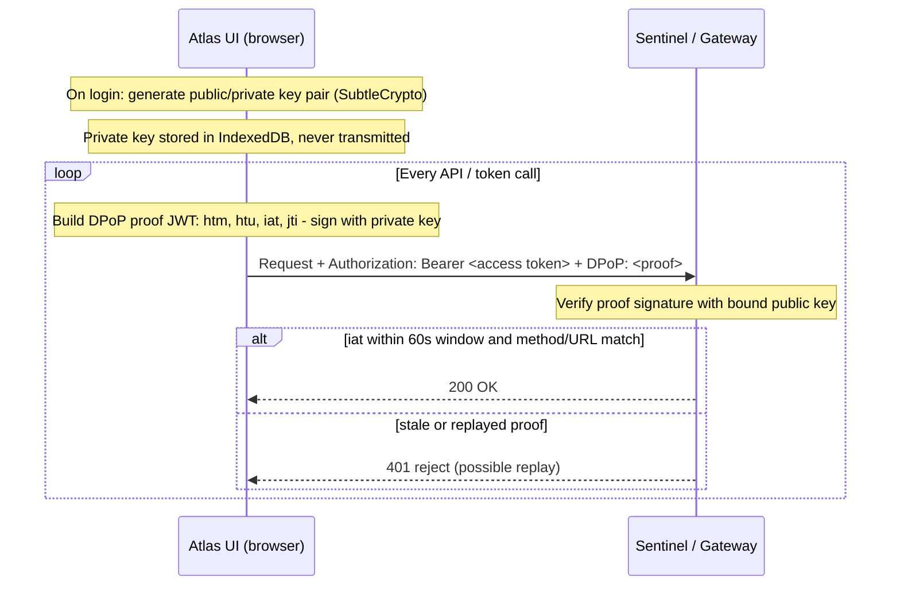

📍 **In our repos (atlas-ui):**
- DPoP proof JWT (`htm`, `htu`, `iat`, `jti`, and `ath` = SHA-256 of the access token) is built and signed **per call** in `auth.service.ts#L1160-L1195`.
- The **private key never enters JS**: signing is delegated to a native **Biometric DPoP plugin** (`createDpopKey` / `signDpop` / `deleteDpopKey`) — interface at `auth.service.ts#L73-L77`, lifecycle at `auth.service.ts#L815-L850`. **This is stronger than the "IndexedDB" wording in the source doc** (key material is held in the OS keystore, not IndexedDB).
- Proof generation is guarded by a **DPoP lifecycle lock** (`auth.service.ts#L1178-L1200`) to stop concurrent calls minting multiple key namespaces.

⚠️ **Gaps to verify (not fully in the repos we have):**
- The client sets `iat` (`auth.service.ts#L1160`) but the **60-second replay window is enforced server-side** — that enforcement lives in Sentinel/Gateway config **not present in these repos**. The doc's claim that Sentinel and Gateway enforce it *independently* cannot be verified here; treat any "replay window" finding as **NEEDS-EVIDENCE** until the Gateway policy is sourced.
- HUB `HttpAdapter` classes (credential services) that make server-to-server calls should attach a **fresh** proof per call — confirm none cache a proof.

---

### 2.4 Token types — quick reference

| Token | Lives where | Purpose | Lifetime idea |
|---|---|---|---|
| **ID token** | Not persisted long-term; parsed at login | Proves *who* the user is (identity claims incl. masked logon ID) | Short-lived, one-time use per login |
| **Access token** | Browser memory only | Used to call Atlas APIs; DPoP-bound | Short (~minutes); refreshed proactively 15 seconds before expiry |
| **Refresh token** | Browser session storage | Used to get a new access token without re-login; also powers NativeMFA biometric re-auth | Longer-lived, tied to session |
| **Remember Me token** | Device storage (cookie/local) | Pre-fills username/card# next visit; two formats — legacy and new Sentinel format (auto-migrated) | Long-lived, device-scoped |
| **DPoP key pair** | IndexedDB (private key never transmitted) — *in code: OS keystore via native plugin* | Proves possession of the token | Session-scoped |

---

## 3. Login (Sign-In) — UC.3-1.1.1

**Simple version:** customer enters card number or User ID + password (or biometric); the app proves this to Sentinel, gets tokens, then tells Atlas BFF "start my session," and BFF loads account data.

**Step by step:**

1. Atlas UI collects credential (password or card/User ID) and **encrypts it client-side** before sending to AuthKit MFE, which sends it to Sentinel's `/auth` endpoint.
2. Sentinel calls **CredentialAuthentication service** to validate the password against Directory.
   - If login is by **User ID** (not card number), Sentinel calls **Credential Management Service** to look up the associated card number and transaction CIF ID (internal customer ID), tagging them as `x_proxy_cardnumber` / `x_transaction_cifID`.
3. Sentinel publishes a **password validation event** to EventBus (used for login-optimization prefetch, see §4).
4. Sentinel returns an **authorization code + callback URL** to AuthKit MFE.
5. Atlas SPA calls Sentinel `/authorize` with that code; Sentinel validates the **PKCE `code_verifier`** (see §2.2) and returns **access + refresh tokens**.
6. Sentinel pushes sign-in success/failure/attempt events (including RiskEngine fraud-assessment results from the risk vendors) to a new **SignIn event topic**.
7. Atlas UI generates the **DPoP key pair** (§2.3) and starts using DPoP-signed calls from here on.
8. Atlas UI calls `/initAppSession` on Atlas BFF to start the *application* session (separate from the *security* session held by Sentinel). BFF:
   - Stores an `IDP_Correlation_ID` to tie the BFF session back to the Sentinel session.
   - Retrieves the credential record from Directory (card number, credential creation date).
   - Loads account summary — from GridCache if the login-optimization prefetch already ran (§4), otherwise live.
   - Writes login success/failure events (`AuthEvents.App.LoginSuccess` / `LoginFailure`) with UserId/GUID/Card Type fields.

**Also enforced during login (unchanged legacy behavior, carried into R3):**
- **Password Lock** (soft lock) and **OTP Lock** (hard lock) after repeated failures.
- Small-business customer role/business-category checks.
- Login timestamp tracking.

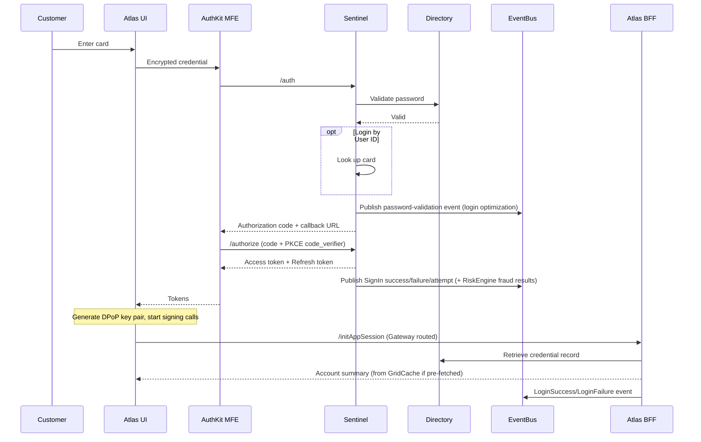

📍 **In our repos:**
- Client-side credential encryption before `/auth` is real: RSA public-key import + AES key generation in `atlas-ui/src/app/core/services/payload-encryption.service.ts#L86-L115`.
- Step-up authorize (change password / login-id / MFA) in the MFE: `authkit-mfe/src/app/core/authentication.service.ts#L289-L302`.
- EventBus sign-in/login events are published through the adapter (`eventbus-adapter/.../PublishProducerEventService.java#L36-L46`); `AuthEvents.*` topic constants in `CommonConstants.java#L71-L87`.

⚠️ **Watch:** the MFE step-up authorize **also** uses an `alg:none` `unsigned_jwt` (`authentication.service.ts#L289-L302`) — same class of issue as §2.2. `/initAppSession` (Atlas BFF) is **not** in the repos we have.

---

## 4. Remember Me & Login Optimization — UC.3-1.1.2 / UC.3-1.1.3

**Remember Me (simple):** a token on the device says "this is the same browser/device that logged in as user X before," so Atlas pre-fills the username/card number field. R3 supports **two formats**: a legacy token and the new Sentinel-format token. If a legacy token is detected, it's **silently migrated** to the new format — the customer doesn't notice.

**Login Optimization (simple):** don't make the customer wait for account data to load *after* they finish authenticating — start fetching it the moment the password is confirmed, in parallel with the rest of the auth flow finishing.

1. Sentinel validates password (this is the earliest point we can trust the login will likely succeed).
2. Sentinel publishes a **login-optimization event** to a new EventBus topic (with the customer's language preference `applicationInfo.userLang` attached).
3. `profile-service` service subscribes to this event, **filters out credit-card logins** (not eligible), and **prefetches the customer's profile info into GridCache**.
4. When BFF eventually needs this data (after full login completes), it checks GridCache first — a hit means near-instant account summary load.

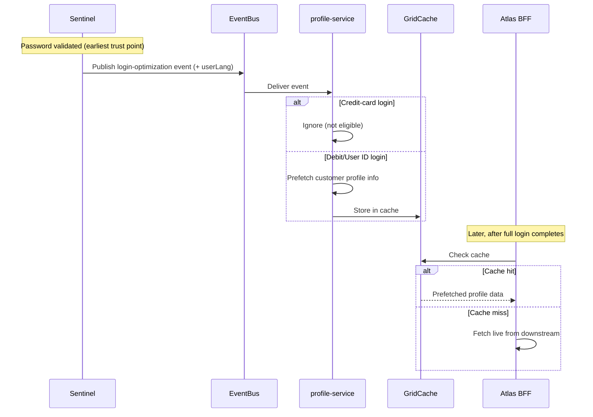

📍 **In our repos (atlas-ui):** Remember-Me is implemented, but only the **new** path is clearly present.
- Adapter: `remember-me-token.adapter.ts`; saved-card model carries `remembermeToken` (`saved-card.service.ts#L22`).

⚠️ **Missing / verify:** the doc's legacy→new-format **silent migration** and the **64-byte hashed-card alias** preservation are Directory/Credential-Management-Service concerns — not found in the client repos here.

**Architect note.** The login-optimization event is a *pre-authorization trust decision*: data is prefetched after password validation but **before** the full OAuth flow, fraud scoring, and any step-up complete. That is a deliberate latency/risk trade. The mitigating design choices are (a) it caches *profile* data only, (b) credit-card logins are excluded, and (c) the cache is only *read* by BFF after full login. Any change that widens what is prefetched, or that lets the cache be read before full login completes, converts a performance optimization into an authorization bypass. This is exactly the class of question an architect is expected to raise.

---

## 5. Biometric Authentication — UC.3-1.2.1 / UC.3-1.2.2

Two parallel mechanisms co-exist in R3:

| | **Legacy Biometric** | **NativeMFA Biometric** |
|---|---|---|
| Where tokens live | legacy database (proprietary) | Sentinel, using **OAuth refresh tokens** |
| New registrations in R3 | ❌ not allowed (existing users keep working) | ✅ only path for new registrations |
| Validation | Atlas Credential Adaptor checks against LegacyBioDB | Native Sentinel/NativeMFA OAuth flow |

**Plain language:** NativeMFA (Mobile Multi-Factor Authentication) is IBM the IdP platform's built-in biometric flow. Instead of Northwind storing its own biometric token format, the phone's fingerprint/FaceID **unlocks a stored OAuth refresh token**, which is then exchanged the same way any refresh token is — no separate proprietary validation logic needed. This is why **NativeMFA registration is implemented as a High-Risk Transaction (step-up) internally** — see §7.

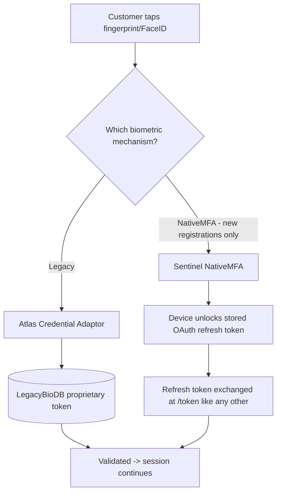

⚠️ Legacy biometric validation ("Atlas Credential Adaptor → LegacyBioDB") is a **backend concern not present in these repos**.

**Architect note.** The strategic move here is *replacing a proprietary secret store with a standard token lifecycle*. The biometric is not an authentication factor being transmitted — it is a **local unlock gesture for a key/token that already exists**. That distinction (local authenticator vs. remote factor) is the same one that underpins FIDO2/WebAuthn and passkeys, and it is the correct answer whenever someone asks "is the fingerprint sent to the bank?" — it is not.

---

## 6. Session Management, Keep-Alive, Logout, and Timeout — UC.3-1.3.1 / UC.3-1.3.2

This is the section most relevant to reliability/session findings. Three intertwined sub-flows.

### 6.1 Keeping a session alive while active

- Before **every** API call, Atlas UI checks: is the access token expired, or **less than 15 seconds from expiring**? If so, it calls Sentinel `/token` (using the refresh token) to get a new access token **before** making the actual API call. This avoids a race where the token expires mid-request.
- Gateway exposes a dedicated **keep-alive API** the UI can call to extend the session while the user is actively working, without doing a full token refresh.
- When the session-expiry warning popup appears and the user clicks **"Stay Signed In,"** the UI uses the refresh token to get new tokens and **swaps them in-place**, replacing the old ones.

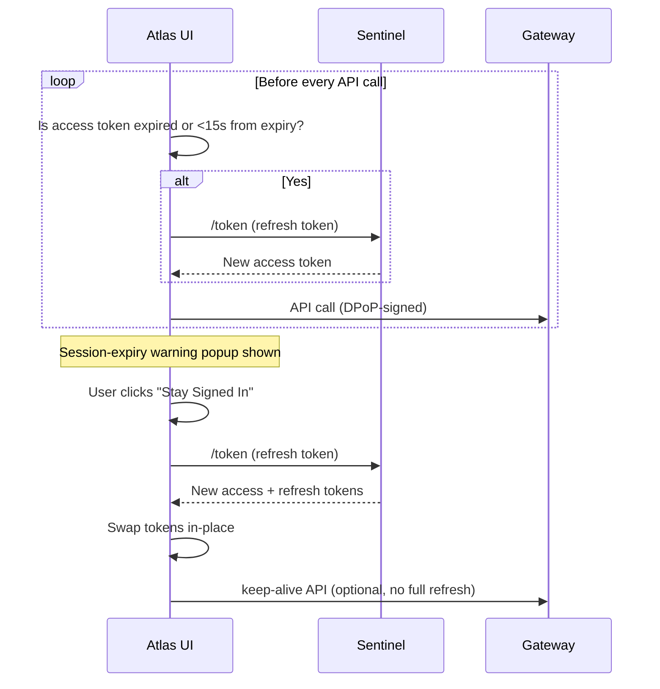

📍 **In our repos (atlas-ui):** the 15-second proactive-refresh buffer is real — `TOKEN_EXPIRATION_BUFFER_MS = 15000` (`auth.constants.ts#L123`), consumed by `isTokensValid` (`auth.service.ts#L345-L355`).

### 6.2 Timeout thresholds (hardcoded business rule, worth knowing for any timeout finding)

- **Inactive timeout:** 10 minutes of no UI activity → automatic sign-out, reason `"Timeout Sign Out"`.
- **Absolute/forced timeout:** 60 minutes of continuous activity → forced sign-out **even if the user is still active**, reason `"Forced Sign Out"`.
- These two + user-initiated logout are the **three logout reasons** passed to Sentinel's `unified_logout` endpoint.
- **WealthDesk** has its own **overridden** session-inactivity / max-session-lifetime values — a regression-test note in the doc flags that CIAM changes must **NOT** alter WealthDesk's timeout behavior (a good place to look if a "session timeout regression" finding shows up in WealthDesk-adjacent code).
- **Transaction Cache** entries in Gateway have a TTL of exactly **60 minutes** — deliberately matched to the max Atlas session time, so a stale step-up transaction can't outlive its session.

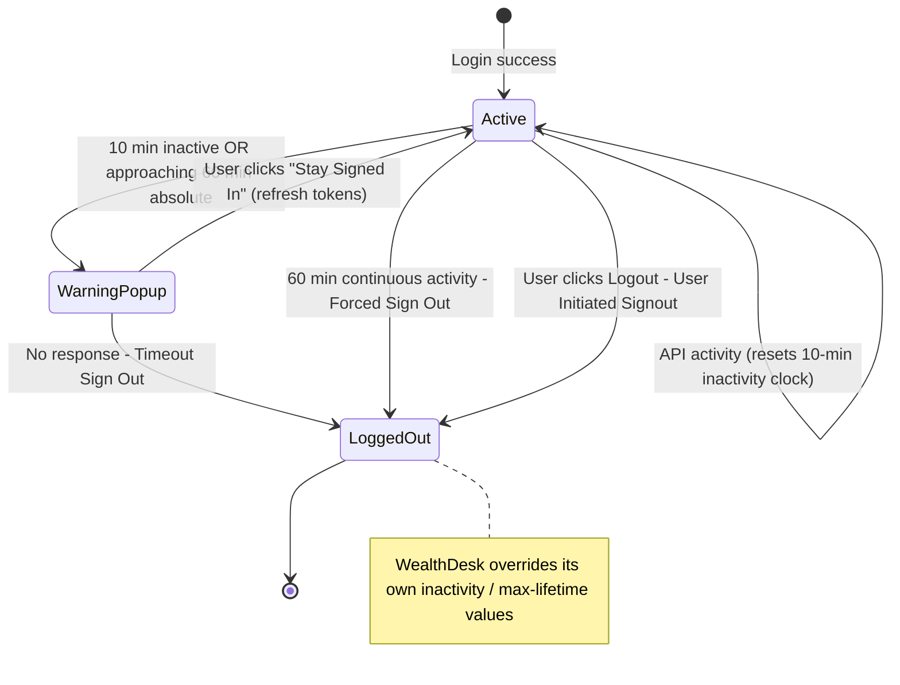

📍 **In our repos (atlas-ui):** timeouts are **config-driven, not hardcoded** — `settingMaxSessionDuration` (60-min absolute) and `settingClientInactivityTimeout` (10-min default) in `app-config.service.ts#L781-L1080`; enforced by `hasSessionExpired()` (`auth.service.ts#L374-L386`).

⚠️ **Watch:** because the values come from remote app-config, a **config regression can silently change timeout behaviour** — the WealthDesk override the doc warns about is a **config** concern, so validate it there, not in code.

### 6.3 Logout sequence (user-initiated)

1. Customer clicks **Logout**.
2. Atlas UI calls Sentinel's `authorize` endpoint afterward to redisplay the login page (post-logout).
3. Atlas UI calls the **Atlas BFF `/logout`** endpoint (routed through Gateway) to end the BFF application session.
4. Atlas UI calls Sentinel `unified_logout`, passing the reason (user-initiated / timeout / forced).
5. **Regardless of whether the above calls succeed or fail**, Atlas UI must locally clear:
   - access token, refresh token
   - DPoP public/private key pair
   - any other client data stored on device

   This **"clear no matter what"** rule is explicit in the doc — a token/DPoP key left behind after a *failed* logout call is treated as a **real risk, not an edge case to ignore**.
6. Sentinel invalidates the access token in its **token cache**, and pushes a logout event to a new **IdP Logout** EventBus topic (`AuthEvents.LogoutEvent.L0`), carrying the reason. Downstream: IdP Datamart, Warehouse, Splunk all subscribe to this topic for reporting.
7. **Note** (found deeper in the doc, §"session_logout"): the endpoint naming evolves — some sequence diagrams reference `session_logout` *replacing* `unified_logout` — worth double-checking which endpoint name is actually current in a given repo before assuming logout is broken.

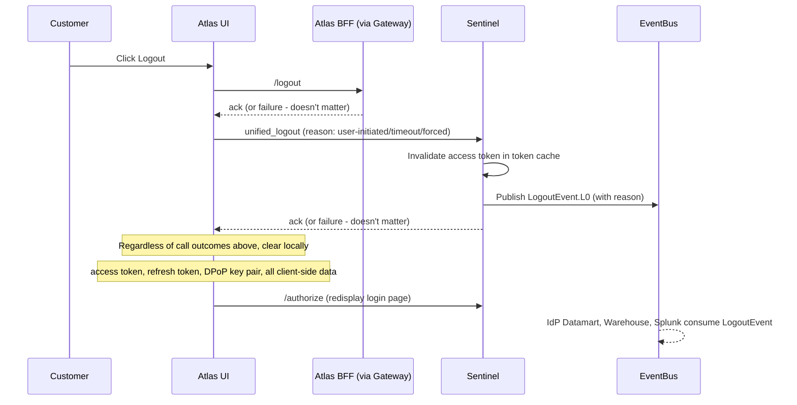

### 6.4 Security-error forced cleanup (important edge case)

If Sentinel or Gateway detect a **"token alteration"** scenario (tampered/invalid token or DPoP proof), Atlas UI must:

1. Remove the DPoP keys.
2. Clear all tokens + session storage.
3. Display the session-expiry page.
4. **Additionally, for the Gateway error case specifically, call logout on Sentinel *before* clearing UI state** (an extra step **not** required for the Sentinel-error case) — a subtle ordering detail that's easy to get wrong in implementation and a good target for a targeted finding/test.

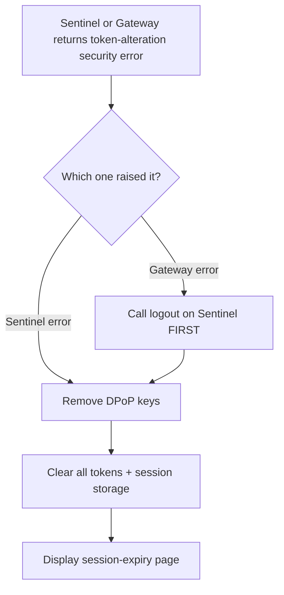

📍 **In our repos (atlas-ui):** the "clear no matter what" cleanup exists as a **separate method**, `cleanupTokensAndTimeouts()` (`auth.service.ts#L781-L812`), which clears sessionStorage token keys, cookies, permanent storage, the DPoP key (`cleanupStoredDpopKeyAndState`, `auth.service.ts#L815-L850`) and PKCE codes. The `logout()` method itself (`auth.service.ts#L762-L774`) **only** calls `isamClient.logout()` and **re-throws on error** — its `finally` block just resets `logoutInProgress`.

⚠️ **High-value check:** the doc's rule is "clear locally **even if the server logout call fails**." In code the server call (`logout()`) and the local cleanup (`cleanupTokensAndTimeouts()`) are **decoupled** — orchestrated by `LogoutService`. Confirm `LogoutService` calls `cleanupTokensAndTimeouts()` in a `finally` (or after catching the re-thrown error); **if it only cleans up on the success path, tokens + DPoP keys survive a failed logout — a direct contradiction of §6.3/§6.4 and a strong candidate finding.** Also verify the **Gateway-error ordering** (logout on Sentinel *before* clearing UI state) required by §6.4.

---

## 7. DPoP-Protected API Calls & High-Risk Transaction (HRT) Step-Up — UC.3-1.4.1 / UC.3-1.4.2

**Simple version:** every API call the customer makes is signed with DPoP (§2.3). For sensitive actions (adding a payee, transferring money, changing alert delivery methods, PIN reset, etc.), the system additionally checks fraud risk in real time and may demand OTP/step-up before letting the transaction through.

1. Atlas UI attaches a DPoP proof to every request, using the DPoP-protected access token.
2. **Gateway validates the DPoP proof for every transaction** (not just login):
   - checks the `iat` is within the same **60-second window** as Sentinel does, **independently**.
   - **caches the Policy Decision Point (PDP) result** locally to speed up repeated checks.
   - stores the pending transaction **payload** in a **Transaction Cache (60-min TTL)** while step-up is pending.
3. If the transaction is **high-risk** (from a fixed list of ~25 transaction types — bill payment, delete EMT recipient, PIN reset, alert delivery method changes, etc.), Sentinel calls **RiskEngine** (Enterprise Risk Assessment / fraud engine) with the transaction ID and custom facts.
   - RiskEngine scores the risk. If it returns **"Review," Sentinel fails the transaction outright** (no retry, no soft-decline) — a good thing to remember when triaging "why did this legit transaction get blocked" tickets.
   - If Sentinel's call to vendor analyze itself **times out or fails, Sentinel also fails the transaction** and returns an error — **but** if only the *notify* call to a risk engine or an EventBus publish fails, **Sentinel logs and continues** (doesn't block the customer for a non-critical side-channel failure). This **asymmetry** (hard-fail on core assessment call, soft-fail on side notifications) is **intentional** — don't "fix" it into a blanket fail-open or fail-closed policy without checking which failure mode this actually is.
4. **Anti-replay / session-binding check:** before allowing a step-up to proceed, the system compares the `sub` claim from the **TXSUB** value in the access token against the `sub` stored in the transaction cache/payload. If they don't match (meaning: the transaction cache entry doesn't belong to the token now presenting it):
   - Invalidate the token in the token cache
   - Delete the transaction from the transaction cache
   - **Invalidate all login grants for the user, on both web and mobile**
   - Return a security error to the UI

   This is a strong anti-hijack control — a finding here (e.g. missing `sub`-comparison, or only checking on one of web/mobile) would be **high severity**.

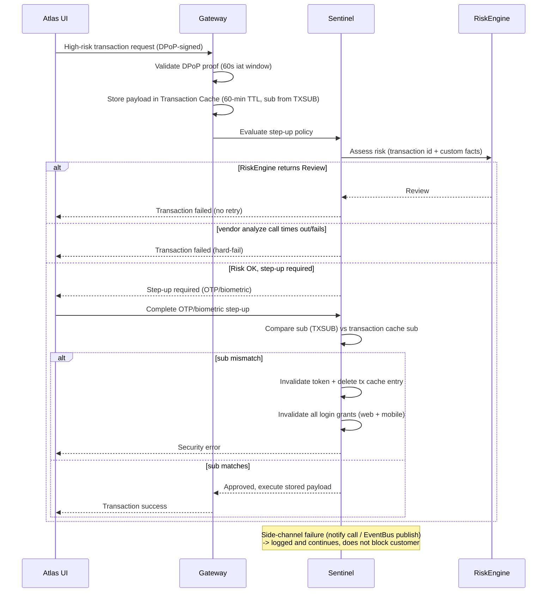

📍 **In our repos (`sentinel-config` — Sentinel mapping rules / access policies):**
- TXSUB claim handling: `saveRsubClaims()` (`access_policies/NativeMFA_oauth_AccessPolicy.js#L66`), `mapRsubAttrs()` (`mapping_rules/Hub_pre_token_generation.js#L53`), `RSUB_LIFETIME = 3610s` (`oidcp/OPConstantVars.js#L12`).

⚠️ **Gaps to verify (high severity if missing):**
- The doc's anti-hijack `sub`-comparison (TXSUB in access token vs `sub` stored in the transaction cache, then invalidate token + delete tx-cache entry + invalidate all grants on web AND mobile) **could not be located as an explicit compare-and-invalidate block** — only TXSUB *save/map* was found. A missing or single-channel (web-only) comparison **is exactly the high-severity finding §7 describes**. Trace `AccessPolicyFunctions.js` / the transaction-cache policy before concluding it's implemented.
- The **Transaction Cache** (60-min TTL) and Gateway PDP-result caching live in Gateway config **not present in these repos** — mark related claims **NEEDS-EVIDENCE**.
- The **asymmetric fail behaviour** (hard-fail on vendor analyze, soft-fail on notify/EventBus) is a Sentinel policy detail; confirm in the RiskEngine access-policy JS before "fixing" any fail-open/closed finding.

---

## 8. Single Sign-On (SSO) family — UC.3-1.5.x

The doc covers several **distinct** SSO patterns that use **different mechanisms** — don't assume they're all "the same DPoP/OAuth thing":

| Pattern | Mechanism | Use case |
|---|---|---|
| **SSO into Wealth platform** | Existing OAuth token exchange via Sentinel | Customer navigates from Atlas to Wealth accounts without re-login |
| **Deep links** (eWallet, eTransfer, etc.) | External link → AuthKit MFE authenticates → lands on specific Atlas feature | Marketing/partner deep links |
| **National Sign-In Service** | Atlas acts as an **external IdP/authenticator** for government sites (GovPortal, TaxPortal) | "Use your bank login to sign into GovPortal" |
| **WealthDesk application** | Atlas as authenticator, separate business API | Apply for WealthDesk using existing Atlas identity |
| **LegacyWealth SSO** | **SAML** | Legacy/partner integration still on SAML, not OAuth |
| **Rewards SSO** | Separate integration, current-state diagram only (no R3 change) | — |
| **SSO using legacy tokens (current state)** | Being phased out as part of the broader CIAM modernization | — |

**Why this matters for findings:** if a finding says "SSO doesn't use DPoP," check *which* SSO path it is first — some of these (SAML-based LegacyWealth, National Sign-In as external authenticator) are **architecturally outside the DPoP/OAuth token boundary by design, not a gap.**

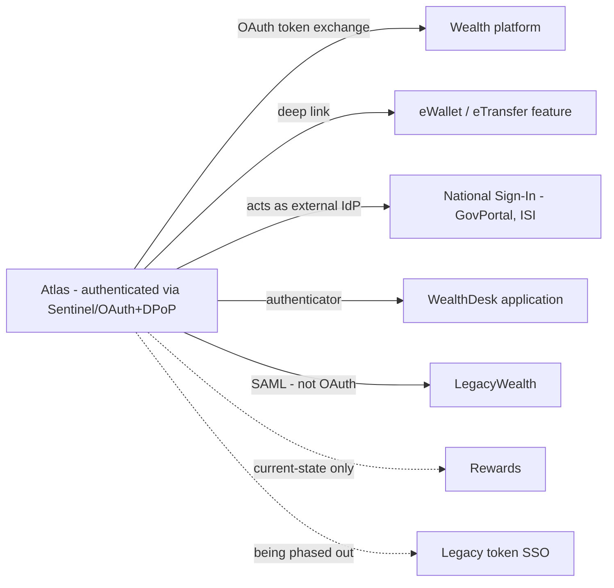

---

## 9. User ID Conversion — UC.3-2.1

**Simple version:** today, most customers log in with a card number. This lets an eligible existing customer create a User ID and convert their login credential from card-number-based to User-ID-based — a **security improvement** (card numbers are guessable/enumerable) **and a regulatory requirement (the prudential regulator)**.

**Key steps:**

1. **Eligibility file** (from the business) is loaded via the eligibility feed → the feed loader → sets enrollment flags in Directory, determining who sees the "create a User ID" prompt.
2. At login, Atlas UI calls a **User ID Conversion eligibility API** — if eligible and not previously dismissed, shows the prompt.
3. **Conversion itself is implemented as a High-Risk Transaction** — it goes through the HRT OTP step-up flow (§7) before being allowed.
4. On conversion:
   - Credential Management Service validates the new User ID isn't blacklisted.
   - **Remember-Me token structure changes:** it now looks up the credential by **GUID** instead of card number, and drops "credential type" from the token.
   - The old card-number-based Remember Me / biometric mapping is **preserved** by matching a **64-byte hashed-card alias** stored in Directory — meaning a user who converts doesn't lose their existing biometric registration.
   - Secure forms (saved payees etc.) tied to the old credit-card credential are migrated to the new debit-card-based credential via a dedicated `SecureFormMigrationService`.
   - A **backup branch in Directory** is created before the conversion so the whole process can be **rolled back** if any step fails partway (see "Rollback and Restore Process" in Confluence, referenced but not detailed in this doc).

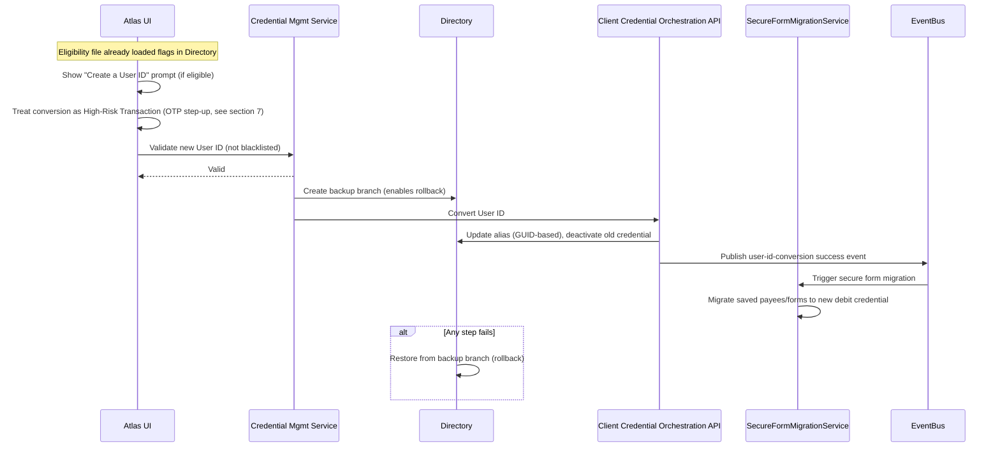

⚠️ **Mostly NOT in the repos we have.** Client-side, only the password blacklist error codes (`PWD_BLACKLIST`) surface in `atlas-ui/src/app/adapters/error.adapter.ts#L225-L226`. `SecureFormMigrationService`, the Client Credential Orchestration API, the GUID-based alias rewrite, and the Directory backup-branch/rollback are **backend services not present here** — treat the whole §9 flow as **NEEDS-EVIDENCE** and do not raise code findings against it from these repos alone.

---

## 10. Power of Attorney (POA), Password Reset, Registration — UC.3-2.2 to UC.3-2.6

These are mostly **Release 3.2, Small-Business-focused** enhancements layered onto the existing self-serve registration and password reset flows (the actual step-by-step reset diagrams are image-only in the source PDF, but the component-change tables describe the logic):

- **P2A role auto-linking (UC.3-2.2.1):** existing role players (e.g., an employee already linked to a business account) automatically get the new POA-related **"P2A" role** so they can receive OTP through their own delivery method, instead of needing manual re-setup.
- **POA registration with existing credentials (UC.3-2.3.x):** a POA user who already has Atlas credentials from another card can extend access to a newly-assigned business card **without creating a second login**.
- **POA password reset (UC.3-2.5.x):** password reset flow gets POA-aware checks — e.g., reject the reset if the card is assigned to a POA role in a way that would create ambiguity, and send confirmation emails to the right party (the small-business owner/Authorized Signatory, not just the POA user).
- **Registration reuse (UC.3-2.4.x):** when generating a registration code for a POA card, reuse the existing user-ID credential from the credit card instead of forcing a brand-new one.
- **Admin console enhancement (UC.3-2.6 / 2.7):** the assisted-channel admin tool gets a new **credential-change history view**, sourced from EventBus events described throughout this document (login, logout, conversion, reset) being fed into the IDP datamart/history tables.

---

## 11. Glossary (from the source doc + standard terms used throughout)

| Term | Meaning |
|---|---|
| **DPoP** | Demonstration of Proof-of-Possession (RFC 9449) — sender-constrains OAuth tokens by binding them to a client-held private key, proven via a signed JWT header on each request. |
| **PKCE** | Proof Key for Code Exchange — protects the OAuth authorization-code exchange for public clients (browsers/mobile apps) using a `code_verifier`/`code_challenge` pair. Not spelled out by name in the source doc, but exactly what the "code verifier" validation step describes. |
| **NativeMFA** | Mobile Multi-Factor Authentication — Sentinel's native biometric mechanism, backed by OAuth refresh tokens. |
| **Sentinel / the IdP platform** | the Identity Provider product referred to as "Sentinel" in the estate's architecture. |
| **TXSUB** | The `sub` (subject/user identifier) claim carried in the access token, used to bind a transaction-cache entry to the specific user who created it. |
| **CIF** | Internal Northwind customer identifier formats used to resolve a login credential to an actual customer record. |
| **Directory** | The LDAP-style directory service storing credentials, aliases, and enrollment flags. |
| **EventBus** | Event streaming/data fabric (Kafka-like) used to propagate login/logout/fraud/conversion events to downstream consumers. |
| **GridCache** | In-memory data grid used for login-optimization prefetch. |
| **BFF** | Backend-for-frontend/orchestration service (Atlas BFF = Atlas's backend application session layer, distinct from the security session in Sentinel). |
| **RiskEngine** | Enterprise Risk Assessment — orchestrates calls out to fraud engines (VendorScore, DeviceTrust, BehaviorIQ) for risk scoring. |
| **HRT** | High-Risk Transaction — any transaction requiring fraud risk assessment and possible step-up (OTP/biometric) before execution. |
| **Edge Gateway** | The API gateway that enforces DPoP validation and step-up policy decisions for business APIs. |

---

## 12. How to use this when reviewing findings

1. Any finding mentioning **"token," "session," or "DPoP"** → first identify **which of the three token lifecycles** it touches (access / refresh / DPoP-key vs remember-me) using **§2.4**, since the storage location and expected cleanup rules differ.
2. Any finding about **replay or "old request accepted"** → check the 60-second `iat` window (**§2.3**) — and confirm whether it's enforced at Sentinel, Gateway, or both, since the doc says both enforce it *independently*, and independent implementations can drift out of sync.
3. Any finding about **logout not clearing state** → compare against **§6.3/§6.4**: the doc's rule is "clear locally no matter what the server call outcome is." If a repo only clears state on *successful* logout calls, that's a direct contradiction of the documented requirement.
4. Any finding about **high-risk transactions failing/succeeding unexpectedly** → check **§7's asymmetric failure handling** (hard-fail on core RSA/RiskEngine call, soft-fail-and-continue on notify/EventBus-publish failures) before assuming it's a bug.
5. Any finding in **WealthDesk session handling** → remember the doc explicitly calls out that WealthDesk's timeout values are *overridden* and must not regress from CIAM changes (**§6.2**).

---

## Appendix A — Concept → Code map (as implemented in the repos we actually have)

**Legend:** ✅ implemented & verified in-repo · 🟡 partial / only one side present · ❌ not in these repos (backend/gateway config lives elsewhere — treat as NEEDS-EVIDENCE).

| # | Concept (section) | Status | Primary code reference(s) |
|---|---|---|---|
| §2.1 | Access token in memory / refresh in sessionStorage | ✅ | `hybrid-token-storage.service.ts#L13-L58` |
| §2.1 | `/token` code exchange | ✅ | `auth.service.ts#L280-L285`, `oauth2.ts#L47` |
| §2.2 | PKCE `code_verifier` + `code_challenge` (SHA-256) | ✅ | `auth.service.ts#L892-L910` |
| §2.2 | `/authorize` request object signed | ❌ **alg:none** | `auth.utils.service.ts#L21-L24` + server accepts `clients.j2#L25` |
| §2.3 | DPoP proof JWT (htm/htu/iat/jti/ath) per call | ✅ | `auth.service.ts#L1160-L1195` |
| §2.3 | DPoP key pair — private key off-JS (native keystore) | ✅ | `auth.service.ts#L73-L77`, `#L815-L850` |
| §2.3 | 60-second `iat` replay window enforcement | 🟡 client sets `iat` only | `auth.service.ts#L1160`; server 60s window = Sentinel/Gateway config **not in repo** |
| §2.4/§6.1 | Proactive refresh 15s before expiry | ✅ | `auth.constants.ts#L123`, `auth.service.ts#L345-L355` |
| §3 | Client-side credential encryption before `/auth` | ✅ | `payload-encryption.service.ts#L86-L115` |
| §3 | MFE step-up authorize (pwd/loginid/MFA) | ✅ (alg:none) | `authentication.service.ts#L289-L302` |
| §3/§4 | EventBus login/logout event publish | ✅ | `PublishProducerEventService.java#L36-L46`, `CommonConstants.java#L71-L87` |
| §3/§8 | `/initAppSession`, GridCache prefetch, profile-service | ❌ | Atlas BFF backend — not in repo |
| §4 | Remember Me (new format) | 🟡 new only | `remember-me-token.adapter.ts`, `saved-card.service.ts#L22` |
| §4 | Legacy→new RememberMe migration / hashed-card alias | ❌ | Directory / Credential Mgmt Service — not in repo |
| §5 | NativeMFA / legacy biometric validation | ❌ | Sentinel NativeMFA + LegacyBioDB adaptor — not in repo (client only invokes) |
| §6.2 | 10-min inactivity / 60-min absolute timeout | ✅ config-driven | `app-config.service.ts#L781-L1080`, `auth.service.ts#L374-L386` |
| §6.3 | `unified_logout` call | ✅ | `auth.service.ts#L762-L774` (endpoint id `unified_logout_all_devices`) |
| §6.3/§6.4 | "Clear local state no matter what" | 🟡 **decoupled** | `cleanupTokensAndTimeouts` `#L781-L812` — **verify `LogoutService` calls it in `finally`** |
| §7 | TXSUB claim save/map | 🟡 | `NativeMFA_oauth_AccessPolicy.js#L66`, `Hub_pre_token_generation.js#L53` |
| §7 | `sub` compare + invalidate grants (web+mobile) | ❌ **not located** | trace `AccessPolicyFunctions.js` / transaction-cache policy |
| §7 | Transaction Cache 60-min TTL, Gateway PDP cache | ❌ | Gateway — not in repo |
| §9 | User ID Conversion / `SecureFormMigrationService` | ❌ | backend orchestration — not in repo (only `PWD_BLACKLIST` error codes client-side) |
| §10 | POA / password-reset enhancements | ❌ | backend — not in repo |

---

## Appendix B — Vulnerabilities & exploits to focus on (concept mapped to real code)

These are the concrete, in-repo issues this explainer surfaces when the architecture is laid over the code. Cross-referenced with the unsigned-JWT inventory scan (2026-08-18).

| What it is | What the code does | Where | Exploit / risk | Severity |
|---|---|---|---|---|
| **Token integrity / identity spoof** | Server decodes `id_token_hint` JWT **without signature verification** (`indexOf('.')` + base64 + `JSON.parse`, then trusts `sub == request_username`) | `PartnerOIDC_pre_token_generation.js#L142-L233` and un-ticketed `BusinessAPI_pre_token_generation.js#L156-L236` | Forge a token with any `sub` → identity spoof / auth bypass. A correct verifier (`JWTSignatureValidationWithPublicKey.js`) **exists but is unused**. | 🔴 **Critical** (SECOPS-1970 covers the first; PBBBankingAPI not yet ticketed) |
| **Request-object integrity** | `/authorize` request object minted as `alg:none` and Sentinel configured to accept it | `auth.utils.service.ts#L21-L24` + `clients.j2#L25/#L89/#L148`; also `JWTtoMap.js#L36` accepts `alg=="none"` | Tamper with request parameters (`redirect_uri`/`scope`) since they're not integrity-protected. `idp_v2` config already fixed to RS256. | 🟠 **High** (config drift) |
| **Step-up integrity** | MFE step-up authorize uses `alg:none` `unsigned_jwt` | `authentication.service.ts#L289-L302` | Same tamper class on change-password/login-id/MFA step-up. | 🟠 **High** |
| **DPoP replay** | Client stamps `iat` but the 60s replay window is enforced only in gateway config not in these repos | client `auth.service.ts#L1160` | If Sentinel/Gateway windows drift or one path skips it, a captured DPoP proof can be replayed. **NEEDS-EVIDENCE** — source the Gateway policy. | 🟡 **Verify** |
| **§6.4 logout cleanup** | Server logout call and local token/DPoP-key cleanup are **decoupled**; `logout()` re-throws on failure | `auth.service.ts#L762-L774` vs `#L781-L812` | If `LogoutService` skips `cleanupTokensAndTimeouts()` on the failure path, tokens + DPoP key **survive logout** → reuse after "logout". Verify orchestration. | 🟠 **High if confirmed** |
| **Anti-hijack** | `sub`/TXSUB compare-and-invalidate not located; only TXSUB save/map found | `Hub_pre_token_generation.js#L53` | Missing (or web-only) comparison lets a step-up transaction be completed with a mismatched token → **transaction hijack**. Trace the transaction-cache access policy. | 🔴 **High if missing** |
| **Client-side decode (Group B)** | Client `jwt_decode` of ID/access tokens with **no verification** | `auth.service.ts#L979`, `sso/state/jwt.service.ts#L44-L165` | Lower risk (token received over TLS, not forged) but **do not use decoded claims for security decisions client-side**. | 🟢 **Low** |

**How to extend this appendix:** when the Gateway, Atlas BFF, and Credential-Management-Service repos are added to the workspace, re-run the concept map for the ❌/🟡 rows (60s window, transaction-cache `sub` compare, RememberMe migration, `/initAppSession`, User ID Conversion) — **those are current evidence gaps, not confirmed passes.**

---

## The one-paragraph version (be able to say this from memory)

> A customer hits the Atlas SPA, which federates in the AuthKit MFE micro-frontend. The credential is encrypted client-side and validated by Sentinel against the Directory. Sentinel runs a standard **OAuth 2.0 authorization-code flow with PKCE** — the SPA is a public client, so it commits to a hashed `code_challenge` up front and redeems the code with the original `code_verifier`. The tokens that come back are **not bearer tokens**: they are **DPoP-bound** (RFC 9449) to a key pair whose private half never leaves the device's secure keystore, so every subsequent call carries a freshly signed proof with `htm`/`htu`/`iat`/`jti`/`ath`, checked against a 60-second replay window independently by both Sentinel and the Gateway gateway. The access token lives in memory only, the refresh token in sessionStorage, and the UI proactively refreshes 15 seconds before expiry. A **second, separate application session** lives in Atlas BFF, tied back by `IDP_Correlation_ID`, and is warmed by an EventBus-driven prefetch that starts the instant the password validates. Sensitive actions escalate into a **high-risk-transaction step-up**: Gateway parks the payload in a 60-minute transaction cache, RiskEngine scores the risk through the risk vendors, and after OTP the system re-binds the transaction to the user by comparing the token's TXSUB `sub` against the cached one — a mismatch nukes the token, the cached transaction, and every login grant on web *and* mobile. Logout is triple-sided (BFF `/logout`, Sentinel `unified_logout`, local clear) and the local clear is unconditional by design. Everything — login, logout, step-up, fraud verdict, conversion — is published to EventBus and consumed by the datamart, Warehouse, and Splunk.
